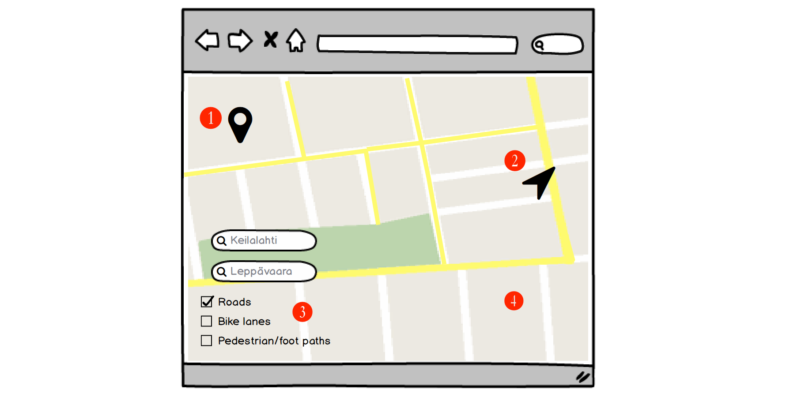

Scenario: Car owner
===

Has an appointment in 2 hours, but outside on the streets are mounds upon mounds of piled up snow, some with cars buried underneath.
 
Should he risk it? But there's a big chance his car might get stuck out there; maybe he should just take the bus and then the tram instead?

So he checked out our lumiaura service:

1. Since he has given prior permission for location access, the app started on his current location.
2. Then he clicked on the general area on the map where his appointment is located.
3. He then checked the 'Roads' because that will help make him decide whether to go by car or not.
4. The service then displayed an overlay of snowplow activities (in yellow) between his starting location and end location.

Seeing that the streets have been plowed already early in the morning, he decided to go by car.